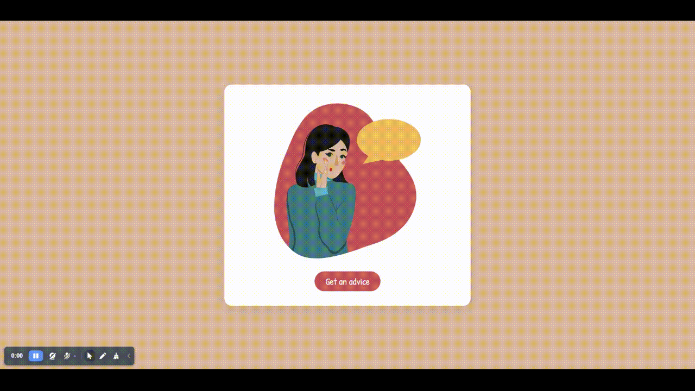

# Random advice generator

#### Instructions
- To generate a random message, you must click on the button

#### Technologies used
- Reactjs
- Styled-components
- [API](https://api.adviceslip.com/)

# Getting Started with Create React App

This project was bootstrapped with [Create React App](https://github.com/facebook/create-react-app).

## Available Scripts

In the project directory, you can run:

### `npm start`

Runs the app in the development mode.\
Open [http://localhost:3000](http://localhost:3000) to view it in your browser.

The page will reload when you make changes.\
You may also see any lint errors in the console.
